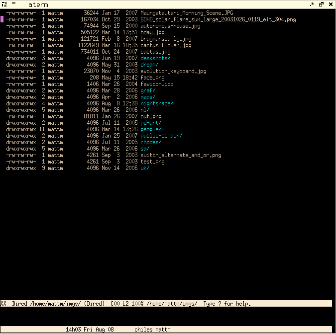

Mad project from 2006 aimed at creating a public domain Lisp OS.  I spent most of the time playing around with the Emacs-like editor.  Derived from CMUCL 18c.

For info on building the system see the [System Building](https://github.com/mattmundell/nightshade/blob/a01f22b5b88b0a72948e8daf295034b9d614b44f/src/code/build.lisp#L102) docs in the source (especially [Build Tools](https://github.com/mattmundell/nightshade/blob/a01f22b5b88b0a72948e8daf295034b9d614b44f/src/code/build.lisp#L283), [Compiling the C](https://github.com/mattmundell/nightshade/blob/a01f22b5b88b0a72948e8daf295034b9d614b44f/src/code/build.lisp#L310), etc).

Note that Nightshade will segfault on recent systems due to stack protection being turned on.  I last had it working on Ubuntu 20.04.

## Changes

### Changes from 1g to 1h (2009-05-01):

  - Improve stability of the XLib interface.
  - Improve reader eof-errorp behaviour.
  - Add POST, logging and dynamic generation to the HTTP service.
  - Add a simple local delivery SMTP service.
  - In the editor:
      - Add a ChangeLog mode.
      - Add authentication to Netnews.
      - Add a clock and a colour browser.
      - Update the MH interface to add sender details to the contacts db.
      - Rename the Info system to Doc and the GNU Info system to Info.
      - Add manpage, menu, Doc and Info highlighting.
      - Hack together some sketchy UTF-8 support.
      - Add two window sizing commands.

### Changes from 1f to 1g (2009-01-07):

  - Start a boot CD image.
  - Improve the installation setup for building after installing.
  - Start Internet services support; add an echo server; start an HTTP server.
  - Add a cache and circularity handling to the sheet package.
  - In the editor:
      - Add Hex and FASL editing modes.
      - Improve contacts database updating.
      - Add a prompt guide.
      - Add IRC and Gopher clients.
      - Add an interface to the Debian package commands.
      - Add SVN support.
      - Add Calendar highlighting.
      - Add Links mode, for bookmark browsing.

### Changes from 1e to 1f (2008-08-09):

  -  Get the Xlib interface running.
  -  Add coverage/regression tests for the mail handler.
  -  Clean up some of the documentation.
  -  Update the mail handler to cache in batches.
  -  Add `while' and `until' macros.
  -  Add an initial prompt setting for the repl.
  -  Improve `fill-from-netrc'.
  -  Start HTTP support.
  -  Add a mail hack for sending via a web mail interface.
  -  In the editor:
      -  Get the X version working.
      -  Add micro breaks to the rest reminder.
      -  Add foreground and background color customization.
      -  Update the mail interface to use batch caching.

### Changes from 1d to 1e (2008-02-13):

  - Mail more CMUCL contributors (all confirm public domain).
  - Clean up some of the documentation.
  - Add generation of HTML from the documentation.
  - Start coding an Xlib interface.
  - Add #!, for creating scripts (Scripting).
  - Move the config files to a directory: ~/.nightshade/.
  - Start adding coverage/regression tests.
  - Introduce a simple package management system.
  - in the editor:
      - Add a tutorial.
      - Add a mode for the system messages buffer.
      - Add a simple menu system.

### Changes from 1c to 1d (2007-09-16):

  - mail more contributors (all confirm public domain)
  - add a simple remote file interface (via ftp or ssh)
  - clean formatting in src/compiler/
  - move the manuals into the code
  - update the mail handler to handle base64 inline text
  - add a mechanism to sync source trees
  - switch to /dev/ptmx
  - in the editor:
      - add highlighting to mail messages and dired
      - add ginfo mode menu commands
      - add an inspector interface
      - add an SGML mode
      - relax defcommand a little
      - improve lisp mode paragraph filling
      - add a kill ring browsing interface
      - update dired searching to use an adapted group search

### Changes from 1b to 1c (2007-03-14):

  - A simple Make-like build system has been added.
  - The mail handling library is complete.
  - The editor mail interface uses the mail handling library instead of an external application.
  - FTP support has improved.

### Changes from 1a to 1b (2007-02-06):

  - The public domain statuses of most contributions to CMUCL 18c have now been confirmed.
  - The code in directory code/ is more consistently formatted.
  - in the editor:
      - simple package and event interfaces
      - starts at Telnet and FTP clients and enriched text handling
      - beginnings of a mail handling library (i.e. an MH replacement) and a document preparation system.

### Changes from 1 to 1a (2006-12-02):

  - Adds the original CMU documentation.

### Changes from 0.0+ to 1 (2006-12-01):

  - The 0.0+ additions transfered to a stripped down CMUCL 18c.

### Changes from 0.0 to 0.0+ (2006-12-01):

  - The endpoint of development based on the 2002 CMUCL CVS.
  - in the editor: improved highlighting and very basic modes for a few C-like languages.

### Changes from CMUCL to 0.0 (2006-11-01):

  - The initial version, based on the CMUCL CVS of 2002-08-23-19h00.
  - Editor additions:
      - command histories
      - a basic version control system interface
      - process listing
      - a simple calendar with appointments
      - a w3m interface
      - a small address database
      - online versions of the manuals
      - some improvement to the directory editor
      - a GNU info mode
      - once-off Lisp context highlighting.
